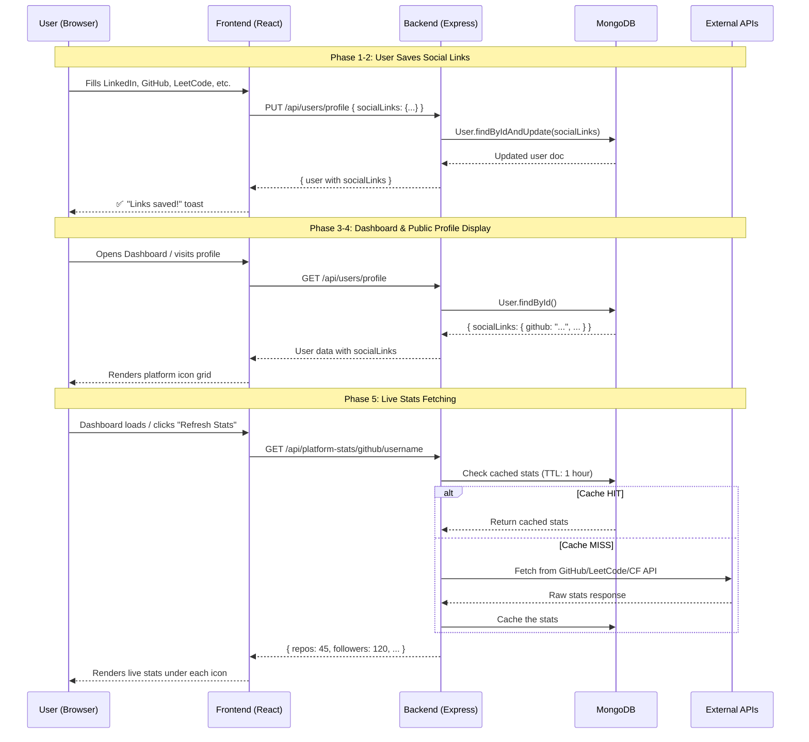
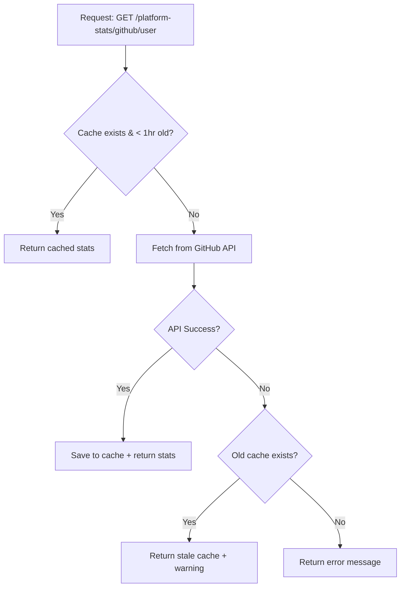

# 🔗 Professional IDs & Live Stats — Step-by-Step Workflow

## Complete Data Flow



---

## Step-by-Step Procedure & Outcomes

---

## 🔧 PHASE 1 — Backend Schema + API

### Step 1.1: Add `socialLinks` to User Model

**File:** `backend/models/User.js`

**What we do:**
- Add a nested `socialLinks` object to the Mongoose schema with fields for all 8 platforms
- Each field is a `String` with default `''`

**Code Change:**
```diff
  bio: { type: String, default: '' },
  profileImage: { type: String, default: '' },
+ socialLinks: {
+   linkedin:   { type: String, default: '' },
+   github:     { type: String, default: '' },
+   leetcode:   { type: String, default: '' },
+   codeforces: { type: String, default: '' },
+   twitter:    { type: String, default: '' },
+   portfolio:  { type: String, default: '' },
+   kaggle:     { type: String, default: '' },
+   medium:     { type: String, default: '' },
+ },
  communityId: { type: mongoose.Schema.Types.ObjectId, ... },
```

**✅ Outcome:** MongoDB now stores social links for every user. Existing users get empty strings (no migration needed).

---

### Step 1.2: Update PUT `/profile` Route

**File:** `backend/routes/users.js`

**What we do:**
- Accept `socialLinks` from the request body
- Pass it to `findByIdAndUpdate()`

**Code Change:**
```diff
- const { fullName, location, bio, profileImage } = req.body;
+ const { fullName, location, bio, profileImage, socialLinks } = req.body;
  const user = await User.findByIdAndUpdate(
      req.user._id,
-     { fullName, location, bio, profileImage },
+     { fullName, location, bio, profileImage, socialLinks },
      { new: true }
  ).select('-password');
```

**✅ Outcome:** Users can save their social links via the existing profile API. GET `/profile` already returns the full user doc, so `socialLinks` is automatically included.

---

### Step 1.3: Verify Public Profile Route

**File:** `backend/routes/connections.js`

**What we do:**
- Check the `GET /user/:id` endpoint
- Ensure `.select()` does NOT exclude `socialLinks`
- If it uses explicit selection like `.select('fullName username bio')`, add `socialLinks`

**✅ Outcome:** When anyone visits another user's public profile, `socialLinks` is part of the response.

---

## 🎨 PHASE 2 — Profile Edit Form

### Step 2.1: Add Social Links Form to Profile Page

**File:** `frontend/src/pages/Profile.jsx`

**What we do:**
1. Initialize `socialLinks` state from `user?.socialLinks`
2. Add a new card section titled **"Connected Platforms"** below the existing bio field
3. Render 8 input fields, each with:
   - Platform icon (colored)
   - Platform name label
   - URL input with placeholder
4. On form submit, include `socialLinks` in the `PUT /api/users/profile` request

**Visual Layout:**
```
┌─────────────────────────────────────────┐
│  🔗 Connected Platforms                 │
├─────────────────────────────────────────┤
│  [🔵 LinkedIn ]  https://linkedin.com/  │
│  [⚫ GitHub   ]  https://github.com/    │
│  [🟠 LeetCode]  https://leetcode.com/  │
│  [🔵 Codeforces] https://codeforces.c  │
│  [🐦 Twitter  ]  https://x.com/        │
│  [🌐 Portfolio]  https://mysite.com     │
│  [🔷 Kaggle   ]  https://kaggle.com/   │
│  [⬛ Medium   ]  https://medium.com/@   │
│                                         │
│                     [ Save Links ]      │
└─────────────────────────────────────────┘
```

**✅ Outcome:** Users can enter their platform URLs/usernames and save them. Data persists in MongoDB and shows up immediately on refresh.

---

## 📊 PHASE 3 — Dashboard Stats Widget

### Step 3.1: Create `PlatformLinksWidget` Component

**New File:** `frontend/src/components/PlatformLinksWidget.jsx`

**What we do:**
1. Create a reusable card component that receives `socialLinks` and `theme` as props
2. Filter to only show platforms the user has actually connected (non-empty strings)
3. Render a grid of circular, branded icon buttons
4. Each button opens the user's profile on that platform in a new tab
5. If no links are connected, show an empty state with a link to `/profile`

**Visual Layout:**
```
┌────────────────────────┐
│ 🔗 Connected Platforms │
├────────────────────────┤
│                        │
│  [in] [🐙] [LC] [CF]  │
│  [𝕏]  [🌐] [K]  [M]   │
│                        │
│  Each icon is colored  │
│  and clickable         │
└────────────────────────┘
```

**✅ Outcome:** A beautiful, compact widget component ready for use anywhere.

---

### Step 3.2: Add Widget to Dashboard Right Column

**File:** `frontend/src/pages/Dashboard.jsx`

**What we do:**
1. Import `PlatformLinksWidget`
2. Place it in the right column between the Profile Card and Quick Actions
3. Pass `user?.socialLinks` and `theme` as props

**Dashboard Layout After Change:**
```
┌──────────────────────────┬──────────────────┐
│  Overview Stats          │  Profile Card    │
│  ┌──────┬──────┬──────┐  │                  │
│  │ Proj │ Res  │ Comm │  ├──────────────────┤
│  └──────┴──────┴──────┘  │ 🔗 Connected     │  ← NEW
├──────────────────────────┤  Platforms       │
│  Recent Projects         │  [in][🐙][LC]    │
│  • Project 1             ├──────────────────┤
│  • Project 2             │  Quick Actions   │
├──────────────────────────┤  • New Project   │
│  Recent Resources        │  • Add Resource  │
│  • Resource 1            ├──────────────────┤
│                          │  Communities     │
└──────────────────────────┴──────────────────┘
```

**✅ Outcome:** Users see their connected platforms on the Dashboard at a glance. Clicking any icon opens their profile on that platform.

---

## 👤 PHASE 4 — Public Profile Display

### Step 4.1: Add Platform Icons to Public Profile Header

**File:** `frontend/src/pages/UserPublicProfile.jsx`

**What we do:**
1. Read `profile.socialLinks` from the fetched user data
2. Below the bio and above the stats row, render a horizontal row of branded icon links
3. Only show icons for platforms the user has connected
4. Use the same brand colors as the widget

**Visual Layout (in the gradient header):**
```
        ┌──────────────────────┐
        │      [Avatar]        │
        │    John Doe          │
        │    @johndoe          │
        │  📍 Delhi, India     │
        │  "Full stack dev..." │
        │                      │
        │  [in] [🐙] [LC] [CF]│  ← NEW: Platform icons
        │                      │
        │  12 Posts  45 Follow │
        │                      │
        │  [Follow] [Connect]  │
        └──────────────────────┘
```

**✅ Outcome:** Anyone visiting a user's profile can see and click through to their professional platforms. This adds credibility and networking value.

---

## 📈 PHASE 5 — Live Stats from All Platforms

### Step 5.1: Create Platform Stats Backend Route

**New File:** `backend/routes/platformStats.js`

**What we do:**
1. Create a protected route: `GET /api/platform-stats/:platform/:username`
2. Implement fetchers for each platform:

| Platform | API Endpoint | Stats Fetched |
|---|---|---|
| **GitHub** | `https://api.github.com/users/:username` | Public repos, followers, following, stars |
| **LeetCode** | `https://leetcode.com/graphql` (POST) | Total solved, easy/medium/hard, ranking |
| **Codeforces** | `https://codeforces.com/api/user.info?handles=:handle` | Rating, max rating, rank title |
| **Kaggle** | Web scraping (no public API) | Competitions, datasets, notebooks |
| **Medium** | RSS feed `https://medium.com/feed/@username` | Recent article count |
| **Twitter** | Limited (no free API) | Display link only, no stats |
| **LinkedIn** | No public API | Display link only, no stats |
| **Portfolio** | N/A | Display link only, no stats |

3. Add error handling for rate limits and unavailable APIs
4. Return a normalized response:

```json
{
  "platform": "github",
  "username": "johndoe",
  "stats": {
    "publicRepos": 45,
    "followers": 120,
    "following": 30,
    "totalStars": 350
  },
  "fetchedAt": "2026-07-03T12:00:00Z"
}
```

**✅ Outcome:** Backend can fetch live stats from GitHub, LeetCode, and Codeforces on demand.

---

### Step 5.2: Add Caching Layer

**What we do:**
1. Add a `platformStatsCache` field to the User model:

```js
platformStatsCache: {
  github:     { stats: Object, fetchedAt: Date },
  leetcode:   { stats: Object, fetchedAt: Date },
  codeforces: { stats: Object, fetchedAt: Date },
  kaggle:     { stats: Object, fetchedAt: Date },
}
```

2. Before calling external APIs, check if cached data exists and is < 1 hour old
3. If cache is valid → return cached data (fast!)
4. If cache is stale → fetch fresh data, update cache, return



**✅ Outcome:** Stats load fast (from cache), external APIs aren't hammered, and stale data is still shown if the API is down.

---

### Step 5.3: Register Route in Server

**File:** `backend/server.js`

```diff
  app.use('/api/notifications', require('./routes/notifications'));
+ app.use('/api/platform-stats', require('./routes/platformStats'));
```

**✅ Outcome:** The new stats endpoint is live and accessible.

---

### Step 5.4: Install `axios` (if not already present) for External API Calls

**File:** `backend/package.json`

```bash
npm install axios
```

> [!NOTE]
> The backend may already use `axios` or `node-fetch`. We'll check the existing `package.json` and use whatever HTTP client is already in use.

**✅ Outcome:** Backend can make outbound HTTP requests to external APIs.

---

### Step 5.5: Extend Dashboard Widget with Live Stats

**File:** `frontend/src/components/PlatformLinksWidget.jsx`

**What we do:**
1. When the widget mounts, call `GET /api/platform-stats/:platform/:username` for each connected platform
2. Show a loading shimmer while stats load
3. Display stats below each platform icon:

**Visual Layout with Stats:**
```
┌─────────────────────────────────┐
│ 🔗 Connected Platforms          │
├─────────────────────────────────┤
│                                 │
│  ┌─────────┐  ┌─────────┐      │
│  │  [🐙]   │  │  [LC]   │      │
│  │ GitHub   │  │LeetCode │      │
│  │ 45 repos │  │350 solved│     │
│  │120 stars │  │Top 5%   │      │
│  └─────────┘  └─────────┘      │
│                                 │
│  ┌─────────┐  ┌─────────┐      │
│  │  [CF]   │  │  [K]    │      │
│  │Codeforces│ │ Kaggle   │     │
│  │ 1423 rat│  │ 12 comp │      │
│  │ Expert  │  │ 5 medals │     │
│  └─────────┘  └─────────┘      │
│                                 │
│  ┌─────────┐  ┌─────────┐      │
│  │  [in]   │  │  [𝕏]    │      │
│  │ LinkedIn │  │ Twitter  │     │
│  │  View →  │  │  View →  │    │
│  └─────────┘  └─────────┘      │
│                                 │
│        Last updated: 2m ago     │
│           [↻ Refresh]           │
└─────────────────────────────────┘
```

**Stats Displayed Per Platform:**

| Platform | Stats Shown |
|---|---|
| **GitHub** | 📦 Repos · ⭐ Stars · 👥 Followers |
| **LeetCode** | ✅ Solved · 🏆 Ranking · 📊 Acceptance Rate |
| **Codeforces** | 📈 Rating · 🏅 Max Rating · 🎖️ Rank Title |
| **Kaggle** | 🏆 Competitions · 📊 Datasets · 📓 Notebooks |
| **LinkedIn** | 🔗 View Profile → (no stats API) |
| **Twitter** | 🔗 View Profile → (no free API) |
| **Portfolio** | 🌐 Visit Site → |
| **Medium** | 📝 Recent Articles count |

**✅ Outcome:** Users see real-time stats from their competitive programming and development platforms right on their dashboard — impressive and functional!

---

### Step 5.6: Add Stats to Public Profile

**File:** `frontend/src/pages/UserPublicProfile.jsx`

**What we do:**
- Reuse the same `PlatformLinksWidget` component (with stats enabled)
- Add it as a new tab called **"Platforms"** alongside Posts, Followers, Following

**✅ Outcome:** Visitors can see a user's competitive stats — rating, problems solved, repos — adding professional credibility.

---

## Complete File Change Summary

| # | File | Action | Phase |
|---|---|---|---|
| 1 | `backend/models/User.js` | **Modify** — Add `socialLinks` + `platformStatsCache` | 1, 5 |
| 2 | `backend/routes/users.js` | **Modify** — Accept `socialLinks` in PUT | 1 |
| 3 | `backend/routes/connections.js` | **Verify** — Ensure socialLinks in response | 1 |
| 4 | `frontend/src/pages/Profile.jsx` | **Modify** — Add social links edit form | 2 |
| 5 | `frontend/src/components/PlatformLinksWidget.jsx` | **Create** — New widget with stats | 3, 5 |
| 6 | `frontend/src/pages/Dashboard.jsx` | **Modify** — Add widget to sidebar | 3 |
| 7 | `frontend/src/pages/UserPublicProfile.jsx` | **Modify** — Add icons + stats tab | 4, 5 |
| 8 | `backend/routes/platformStats.js` | **Create** — Stats proxy with caching | 5 |
| 9 | `backend/server.js` | **Modify** — Register new route | 5 |

---

## Implementation Order (Build Sequence)

```mermaid
gantt
    title Implementation Timeline
    dateFormat X
    axisFormat %s

    section Phase 1 - Backend
    User.js schema update        :done, p1a, 0, 10
    users.js route update        :done, p1b, 10, 15
    connections.js verify        :done, p1c, 15, 20

    section Phase 2 - Profile Edit
    Profile.jsx social form      :active, p2a, 20, 45

    section Phase 3 - Dashboard
    PlatformLinksWidget.jsx      :p3a, 45, 70
    Dashboard.jsx integration    :p3b, 70, 80

    section Phase 4 - Public Profile
    UserPublicProfile.jsx icons  :p4a, 80, 95

    section Phase 5 - Live Stats
    platformStats.js route       :p5a, 95, 130
    Caching layer                :p5b, 130, 145
    Widget stats display         :p5c, 145, 170
    Public profile stats tab     :p5d, 170, 185
```



---

## Final Outcome

After all 5 phases are complete, here's what the user experience looks like:

````carousel
### 1️⃣ Profile Page — Edit Links
Users go to **Profile → Connected Platforms** section and paste their platform URLs.
Each field has a branded icon and placeholder URL.
Click **Save** and all links are stored.

```
┌──────────────────────────────────┐
│         Edit Profile             │
│  [Avatar]  John Doe              │
│  Bio: Full-stack developer...    │
├──────────────────────────────────┤
│  🔗 Connected Platforms          │
│  🔵 LinkedIn: linkedin.com/in/j │
│  ⚫ GitHub:   github.com/john    │
│  🟠 LeetCode: leetcode.com/john │
│  🔵 CF:       codeforces.com/jo │
│              [💾 Save Links]     │
└──────────────────────────────────┘
```
<!-- slide -->
### 2️⃣ Dashboard — Stats Widget
On the **Dashboard sidebar**, a compact card shows all connected platforms with **live stats**.

```
┌─────────────────────────┐
│ 🔗 Platforms & Stats    │
├─────────────────────────┤
│ 🐙 GitHub               │
│   45 repos · 120 ⭐     │
│                         │
│ 🟠 LeetCode             │
│   350 solved · Top 5%   │
│                         │
│ 🔵 Codeforces            │
│   1423 rating · Expert  │
│                         │
│ 🔵 LinkedIn  →  View    │
│ 🌐 Portfolio →  Visit   │
│                         │
│    Updated 5m ago [↻]   │
└─────────────────────────┘
```
<!-- slide -->
### 3️⃣ Public Profile — Visitor View
When someone visits a user's profile, they see **platform icons** in the header and can explore a **"Platforms" tab** with full stats.

```
┌──────────────────────────┐
│     [Avatar]             │
│   John Doe  @johndoe    │
│   📍 Delhi, India        │
│                          │
│  [in] [🐙] [LC] [CF] [𝕏]│  ← Clickable icons
│                          │
│  12 Posts · 45 Followers │
│  [Follow] [Connect]     │
├──────────────────────────┤
│ [Posts][Followers][📊 Platforms] │
│                          │
│  GitHub: 45 repos, 120⭐ │
│  LeetCode: 350 solved   │
│  Codeforces: Expert 1423│
└──────────────────────────┘
```
````

> [!IMPORTANT]
> **Ready to build!** Say "start" and I'll begin implementing Phase 1 through Phase 5 sequentially, with working code for each step.
